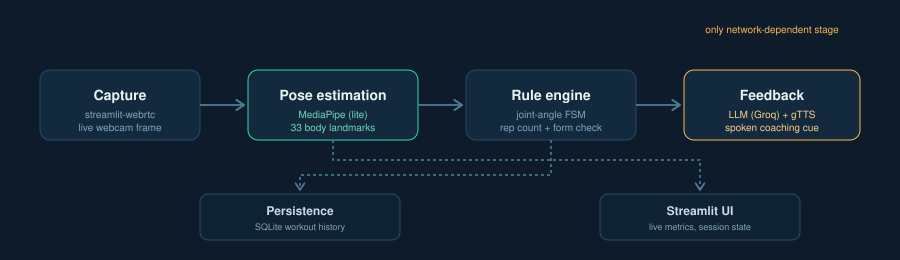

<div align="center">



</div>

##  Sensor-Free, CPU-Efficient Exercise Monitoring: Rule-Based Pose Analysis with LLM-Synthesized Voice Feedback

A real-time, webcam-only AI gym trainer. It counts reps, checks form using joint-angle geometry, and speaks corrections back to you — no wearables, no GPU, no training data.

- **5 exercises** — Squats, Push-ups, Biceps Curls, Shoulder Press, Lunges
- **Rule-based form checking** — interpretable joint-angle thresholds, not a black-box classifier
- **Spoken coaching** — an LLM (Groq) generates the feedback, gTTS speaks it
- **Runs on a laptop CPU** — MediaPipe's `lite` pose model, no dedicated GPU needed

## Architecture

<div align="center">

</div>

Only the **Feedback** stage needs network access — capture, pose estimation, and rep/form logic run fully offline.

**Why rule-based, not a trained model?** No public dataset pairs webcam video with verified rep counts and form labels. Joint-angle thresholds need no training data, stay interpretable, and match the approach used across the published literature on pose-based exercise monitoring.

**Why MediaPipe over OpenPose?** This is single-subject and real-time — MediaPipe's 33-landmark model runs at 30+ fps on CPU; OpenPose's multi-person pipeline is unnecessary overhead here.

## Tech stack

| Layer | Technology |
|---|---|
| App / UI | Streamlit |
| Real-time video | streamlit-webrtc + PyAV |
| Pose estimation | MediaPipe Pose Landmarker (lite) |
| Computer vision | OpenCV |
| Coaching | LLM via Groq API |
| Voice | gTTS |
| Storage | SQLite |

## Getting started

```bash
git clone https://github.com/<your-username>/<your-repo>.git
cd <your-repo>
uv venv && .venv\Scripts\activate      # Windows
uv pip install -r requirements.txt
uv pip install av
```

Add `ml_models/pose_landmarker_lite.task` (MediaPipe model index), then create `.env`:

```
GROQ_API_KEY=your_groq_api_key_here
```

Run:

```bash
uv run streamlit run main.py
```

## Deployment

Needs a **persistent server with WebRTC support** — won't run on Netlify/Vercel. Use [Streamlit Community Cloud](https://share.streamlit.io), Render, or Hugging Face Spaces instead.

For cloud hosting, add a `packages.txt`:

```
libgl1
libglib2.0-0t64
portaudio19-dev
```

> Cloud-hosted camera access often needs a TURN server, not just STUN — a datacenter server and a home-network client are usually both behind NAT.

## Evaluation

Assessed on a self-collected, manually annotated dataset (no public benchmark fits this task):

- Repetition-counting accuracy vs. verified ground truth
- Form-classification precision / recall / F1 per exercise
- Landmark-visibility reliability across lighting/distance conditions
- Real-time throughput (FPS)

Full methodology and results are in the project report.

## Limitations

- Thresholds tuned on a small self-collected dataset — generalization across body types/angles untested at scale
- Single-subject, near-frontal camera assumed
- Not a substitute for professional coaching or physiotherapy

## Roadmap

- [ ] Learned form classifier on an expanded, multi-subject dataset
- [ ] Multi-viewpoint camera robustness
- [ ] Production TURN server for reliable cloud camera access

## License

MIT — see [`LICENSE`](LICENSE).

<div align="center">
<sub>Built with MediaPipe, Streamlit, and the Groq API</sub>
</div>
